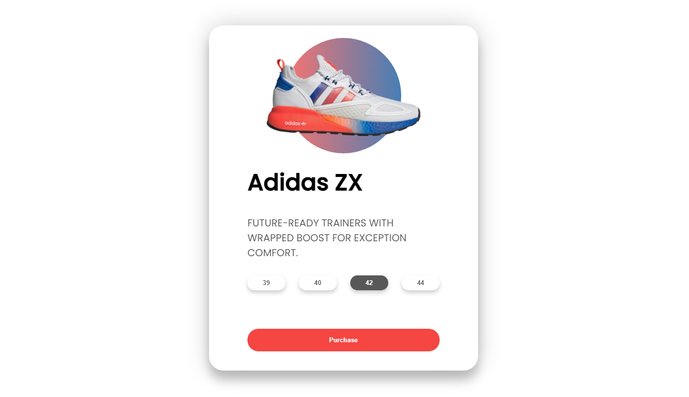

  <a href="#-technologies">Technologies</a>&nbsp;&nbsp;&nbsp;|&nbsp;&nbsp;&nbsp;
  <a href="#-project">Project</a>

 

  

## ✨ Technologies

This project was developed with the following technologies:

- HTML
- CSS
- JS

## 💻 Project

The 3D Effect project is a basic 3D effect product presentation project.

---

by Rafael Matos👋🏻